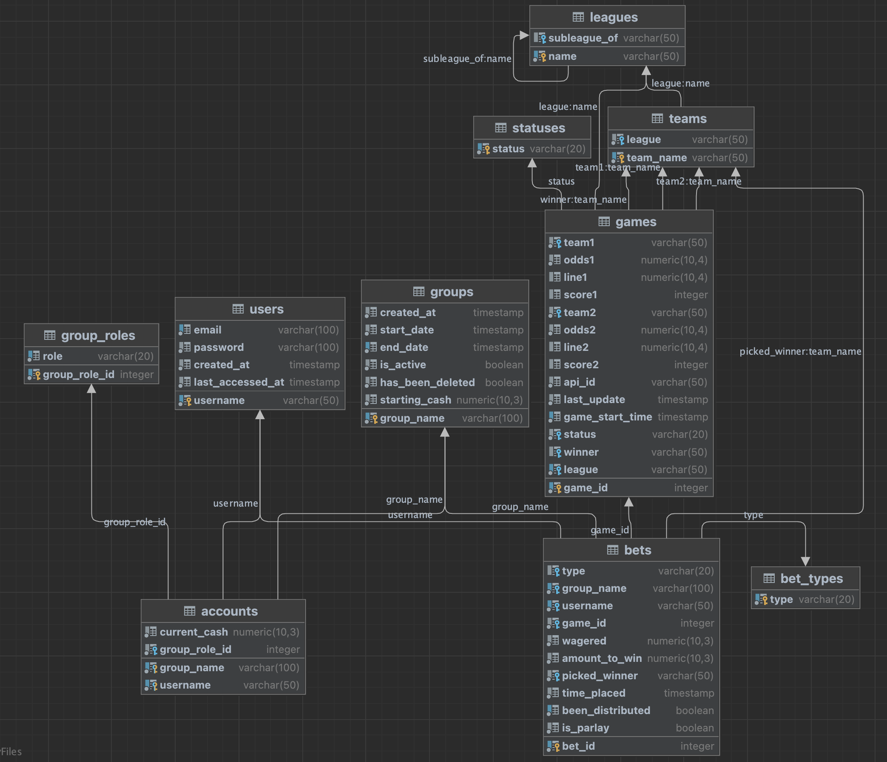

# Better2

Backend of a group-based, simulated sports betting app. Written in Java, utilizing PostgreSQL, Redis, NGINX, RabbitMQ, Maven, Docker, and Kubernetes.

[//]: # (add link to api here too)

[//]: # (languages: Java)

[//]: # (DB/Cache: postgres@16, redis)

[//]: # (tech/protocols: nginx, rabbitmq, HTTPS, AMQP, SMTP, JWTs)

[//]: # (build/deployment tools: Maven managing build process/dependencies, Docker containerization, k8s orchestration, minikube, k9s)

## Components:

[//]: # (insert picture here showing overall structure)

### Ingress
- NGINX ingress functioning as a reverse proxy and SSL/TLS terminator, forwarding traffic towards gateway service. 

### Gateway Service
- HTTP server which directs incoming requests and outgoing responses to and from their appropriate services

### Rate Limiter

### Authentication Service
- Handles signup, login, reset password, and all JWT validation requests
- Asynchronously sends messages (via AMQP) to the email notification service for user signup and password reset via message queue (RabbitMQ)

### JWT Cache

### Email Notification Service
- Asynchronously delivers messages to client email (via SMTP w/ TLS) from messages in queue (RabbitMQ)

### Group Service
- Provides client endpoints to 

### Bet Service
- Provides client endpoints to

### Update Service
- Performs the following non-client-facing jobs:

  - Adds new games on information from api call (runs as a scheduled cronjob on non-persistent pods)
  - Updates game status from "upcoming" to "playing" when game starts via Quartz scheduler and appropriate triggers (runs on persistent pod)
  - Updates game status from "playing" to "settled" based on information from api call and distributes winnings to users on respective bets (runs as a scheduled cronjob on non-persistent pods)
  - Updates group status after the last active day (runs as a scheduled cronjob on non-persistent pods)
- Completed jobs/pods are manually garbage collected every 6 hours (see ./cleanpods/manifests)

### RabbitMQ
- Message queue with 1 GiB PVC and durable messages. Utilizes direct exchange into two queues.

### Database 
- Persistent data store for backend, running outside k8s cluster

## Deploying:

### Gateway Service
- Define env variables for the following in appropriate (configmap) yaml files in ./gatewayservice/manifests:
  - `GATEWAY_HTTP_SERVER_HOST, GATEWAY_HTTP_SERVER_PORT, GATEWAY_HTTP_SERVER_BACKLOG, AUTH_SERVICE_HOST, AUTH_SERVICE_PORT, GATEWAY_THREAD_POOL_CORE_SIZE, GATEWAY_THREAD_POOL_MAX_SIZE, GATEWAY_THREAD_POOL_KEEP_ALIVE, RABBITMQ_HOST, RABBITMQ_PORT`
- Add mapping for 127.0.0.1 to desired host in /etc/hosts

### Authentication Service
- Define env variables for the following in appropriate (configmap/secret) yaml files in ./authservice/manifests:
  - `AUTH_DB_HOST, AUTH_DB_USER, AUTH_DB_PASSWORD, AUTH_DB_NAME, AUTH_DB_PORT, AUTH_HTTP_SERVER_HOST, AUTH_HTTP_SERVER_PORT, AUTH_HTTP_SERVER_BACKLOG, AUTH_THREAD_POOL_CORE_SIZE, AUTH_THREAD_POOL_MAX_SIZE, AUTH_THREAD_POOL_KEEP_ALIVE, AUTH_JWT_SECRET, RABBITMQ_HOST, RABBITMQ_PORT`

### Email Service
 - Define env variables for the following in appropriate (configmap/secret) yaml files in ./authservice/manifests:
  - `SMTP_SERVER_SENDER_EMAIL, SMTP_SERVER_SENDER_HOST, SMTP_SERVER_SENDER_PORT, SMTP_SERVER_SENDER_USER, RABBITMQ_HOST, RABBITMQ_PORT, SMTP_SERVER_PASSWORD`

### Group Service

### User Betting Service

### Update Bet Service

### PostgreSQL
- Install PostgreSQL
    - `brew install postgresql@16`
    - `initdb /usr/local/var/postgres/`
- Start PostgreSQL
    - `brew services start postgresql` (for postgres to run as background service)
    - `pg_ctl -D /usr/local/var/postgres/ start` (for postgres to run in the foreground)
- Initialize DB Tables and Triggers
    - `psql postgres` 
    - `CREATE USER authdbuser WITH PASSWORD 'testauth' CREATEDB;`
    - `CREATE DATABASE authdb with OWNER = authdbuser;`
    - `\q`
    - Insert your host, port, database, user at the top of create_psql_tables.sh (in project root directory). 
    - `./create_psql_tables.sh`
- Drop Tables in DB
    - Insert your host, port, database, user at the top of drop_psql_tables.sh (in project root directory).
    - `./drop_psql_tables.sh`  

### Docker
- Install Docker
  - `brew install --cask docker` 
  - Grant docker privileged access (message when you launch docker)
  
### Kubernetes
- Install Kubernetes
  - `brew install kubectl`

### Minikube
- Install Minikube
  - `brew install minikube`
  - `minikube config set cpu 4`
  - `minikube config set memory 8192`

### Starting Backend
- `./start-backend.sh` in this project root directory, with sudo permissions, to deploy on local computer via minikube

## Client-Accessible Paths
(swagger?)

## Monitoring Backend
### RabbitMQ
- http://rabbitmq-manager.com, after reconfiguring 127.0.0.1 to rabbitmq-manager.com in /etc/hosts, with username "guest" and password "guest"

### Kubernetes
- I will always sing `k9s` praises and recommend it
- Install with `brew install derailed/k9s/k9s`

## Testing
